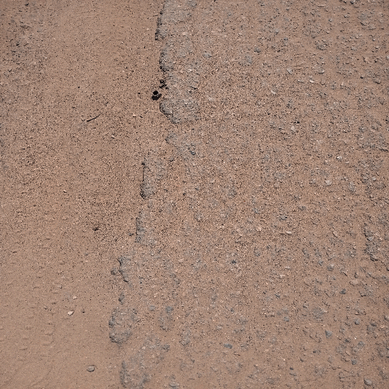

# Road Pavement Damage Analysis

## Overview

This repository contains the code and dataset for the research project which is under review in the **6th International Conference on Electrical Engineering and Information & Communication Technology 2024** conference. The objective of this work is to analyze road damage using computer vision techniques. We created a dataset consisting of 1500 damaged road images categorized into three classes: **potholes**, **cracks**, and **edge cracks**. The dataset was annotated using **Roboflow** and utilized to train **YOLOv5** and **YOLOv8** models for damage detection.

## Dataset Overview

- **Classes**:
  - **Potholes**
  - **Cracks**
  - **Edge Cracks**

## YOLOv8 Best Result

- **Class**: **Pothole**
- **Precision (P)**: 0.820
- **Recall (R)**: 0.815
- **mAP@50**: 0.829

